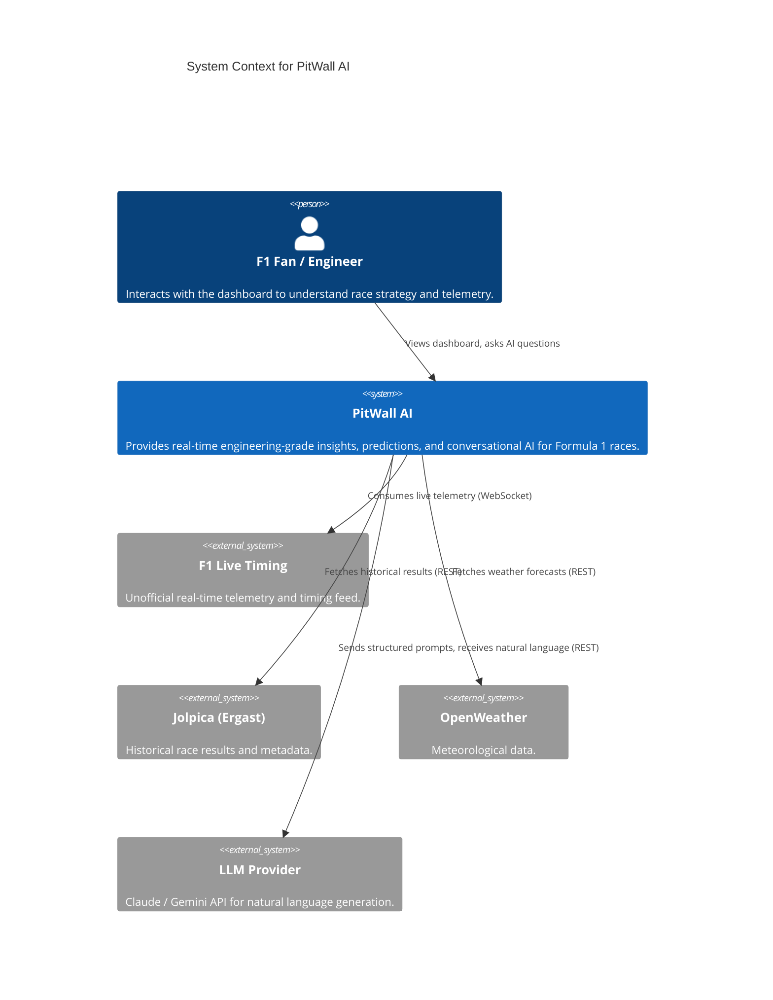
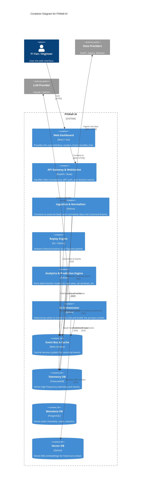

# System Context (C4 Model)

This document describes the high-level architecture of PitWall AI using the C4 model concepts (Context & Containers).

## 1. System Context Diagram

## 2. Container Diagram

## 3. Data Movement Summary

1. **Ingestion**: The Normalizer pulls from `external_data`.
2. **Translation**: Normalizer converts to protobuf Canonical Events and pushes to `redis` streams.
3. **Persistence**: A dedicated worker reads from `redis` and writes to `timescale` and `postgres`.
4. **Analytics**: The Prediction Engine reads from `redis`, computes deterministically, and writes prediction events back to `redis`.
5. **Reasoning**: The AI Orchestrator listens to `redis` for prediction events. If a threshold is met, it queries `qdrant` for context, calls the `llm`, and writes an AI summary event back to `redis`.
6. **Presentation**: The API Gateway subscribes to `redis` and pushes all relevant events via WebSocket to the `spa`.
